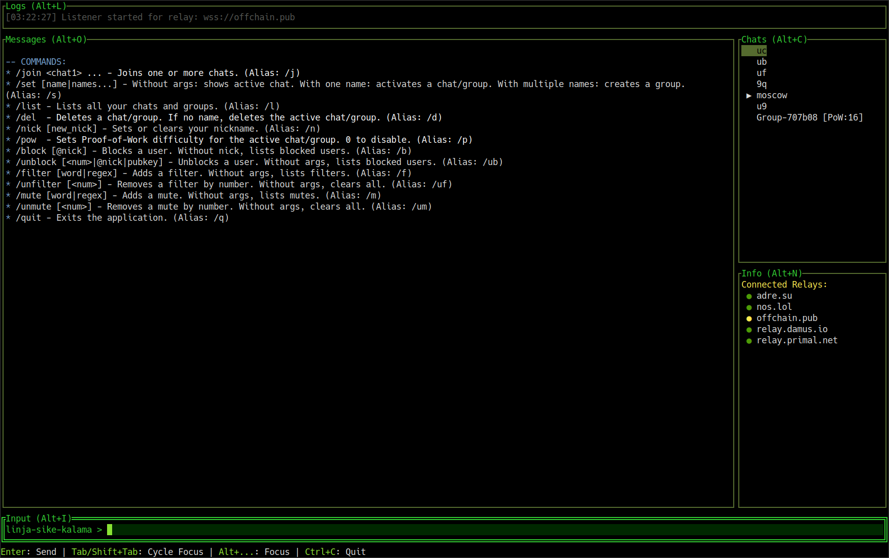

# strchat-tui

[](https://dukenukemmustdie.com)

A simple and stylish TUI client for various Nostr-based chats.



## What is strchat-tui?

**strchat-tui** is a terminal-based Nostr chat client written in Go. It's designed to be a lightweight, fast, and highly-functional way to participate in different kinds of Nostr chat rooms, all from the comfort of your terminal with a retro, hacker-style aesthetic.

The client features smart relay management to ensure your connection is always fast and reliable.

## Features

* **Terminal-Based UI:** A clean, keyboard-driven interface that runs anywhere.
* **Smart Relay Management:**
    * Measures connection latency to find the fastest relays.
    * Automatically abandons unstable or repeatedly failing relays.
    * Publishes events to the fastest connected relays for near-instant message delivery.
* **Multi-Protocol Support:** Designed to support various Nostr chat `kinds`.
* **Geohash Chats:** Join ephemeral chats based on `georelay`.
* **Stylish Theme:** A customizable, hacker-inspired theme with a focus on readability.

## Supported Chat Types

This client aims to support a wide range of Nostr chats.

#### ✅ Currently Supported

* **Kind 23333:** Public, ephemeral, topic-based group chats (e.g., `#moscow`, `#nostr`).
* **Kind 20000:** Geohash-based ephemeral chats for local conversations (e.g., `#21m`).

#### 🔜 Planned for Future Releases

* **NIP-17:** Encrypted Direct Messages (DMs).
* **NIP-28:** Public Chat.
* **NIP-A0:** Voice Messages.
* **NIP-C7:** Chats.
* **NIP-EE:** E2EE Messaging using the Messaging Layer Security (MLS) Protocol.

## How to Run

1.  Navigate to the [**Releases**](https://github.com/lessucettes/strchat-tui/releases) page.
2.  Download the executable file for your operating system (Linux, macOS, or Windows).
4.  Run the executable file from your terminal.

## How to Build from Source

1.  Ensure you have [Go](https://golang.org/) (version 1.18 or newer) installed.
2.  Clone the repository:
    ```bash
    git clone https://github.com/lessucettes/strchat-tui.git
    ```
3.  Navigate into the project directory:
    ```bash
    cd strchat-tui
    ```
4.  Build the application:
    ```bash
    go build .
    ```
5.  Run the client:
    ```bash
    ./strchat-tui
    ```

## License

This project is licensed under the MIT License. See the `LICENSE` file for details.
